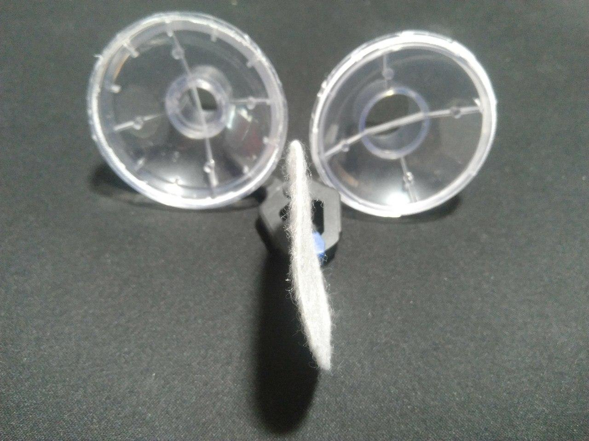
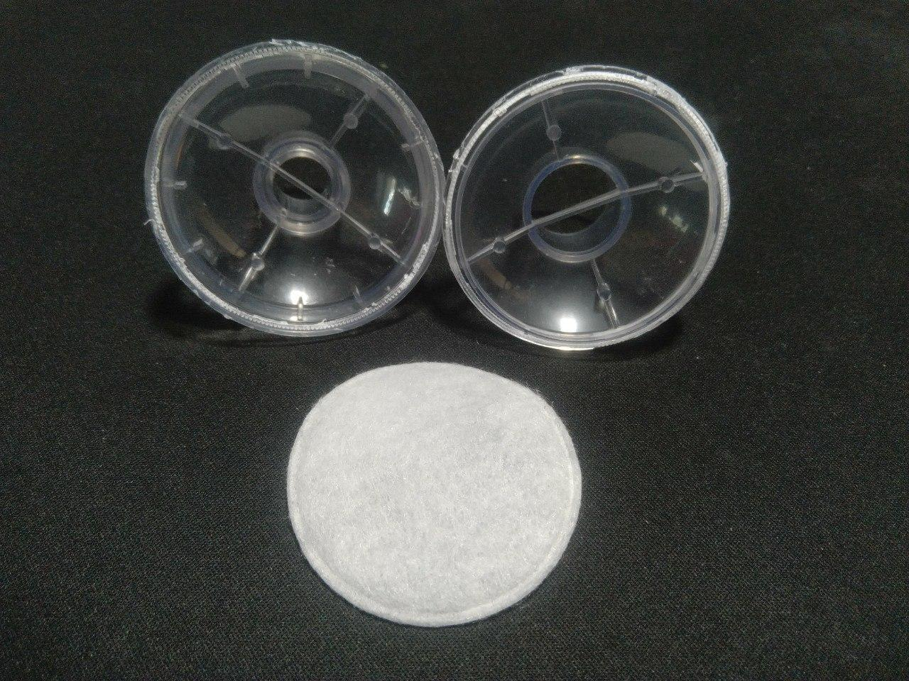
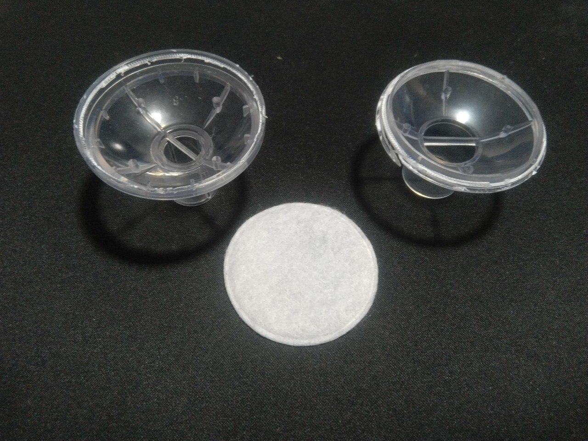
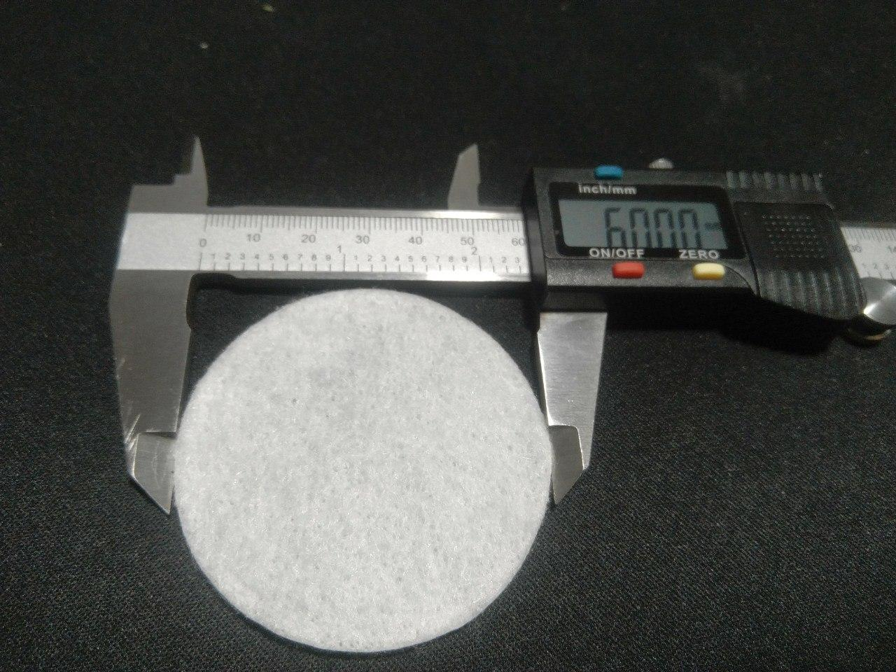

# 3D models 

## Requirements & recommendations

**Supported file formats**

- STL - for 3D printed models
- STEP - for objects representing part to be used as a reference
- Application specific projects (like SolidWorks, Fusion360) - CAD formats other users could edit 

**Unsupported file formats**
- Mesh-based objects (.obj, .3dmax, etc) - these formats are not editable by CAD software and should be avoided.

**3D printing recommendations:**

1. Part dimensions should be within 200x200x200mm - print area limits for most 3D printers
2. Avoid overhangs - parts should be printable without Support
3. For bigger parts please also try to provide stacked version - i.e. parts on top of each other, so we could print them in bulk
4. Recommended print settings should be provided for printing with PET-G (material accepted for medical purposes)

# Reference sheet on original parts

## CPAP filter

### Description

A filter used by ventilators for filtering out dust and moisture particles. Original part consists of two pieces melted together, and filtering membrane inside. The membrane is just a piece of cloth and fiber, it does not have any complex structures HEPA-filters and such.

Accurate part dimensions are captured in **_Inline_filter_VB-65mm.STEP_** file

Currently development is happening in https://github.com/jcl5m1/ventilator/tree/cpap-ventilator branch

### Requirements
The 3D-printed part should consist of 2 pieces. For assembly they could either be glued together (superglue) or use some mechanical lock to make it re-usable. In both scenarios it should be possible to completely seal assembly 

**Reference photos:**

### Recommended print settings
> To be provided

